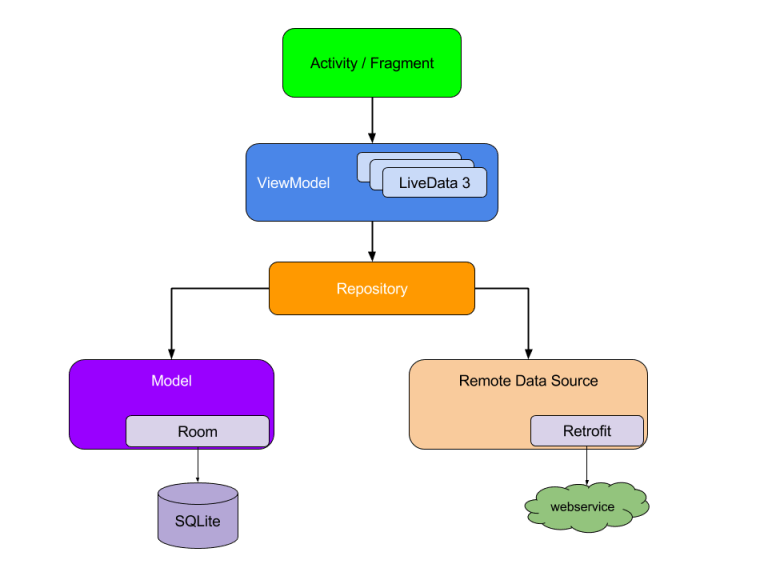

# Files/Folders Structure

## Here is a brief explanation of the project folder structure and some of its main files usage:

```
└── app                                # Contains all source files.                   
│   └── manifests                      # Contains AndroidManifest.xml. It must contain an <application> element and specify xmlns:android and package attributes.
│   └── java                           # Contains the Java source files.           
│   │   └── com.fernando.prueba        # Contains all source files.
│   │   │   └──  data                  # Contains the database holder and serves as the main access point for the underlying connection to your app's persisted. (RoomDatabase)
│   │   │   └──  interfaces            # Contains all interfaces.
│   │   │   └──  interceptors          # Contains the actions executables before call API request.
│   │   │   └──  models                # Contains all our data models.
│   │   │   └──  network               # Contains all networking code.
│   │   │   └──  ui                    # Is a subpackage for all UI-related packages/classes with the architecture MVVM (Factory, Repository, ViewModel).
│   │   │   │   └── user               # Contains the packages/classes related with user
│   │   │   │   └── post               # Contains the packages/classes related with post.
│   │   │   └──  utils                 # Contains all helpers supporting code.
│   │   │   └──  MVVMApplication.kt    # Contains module that enables easy retrieval, of a lot of standard android services. (Kodein-Android)
│   └── res                            # Contains all resources without code, such as XML layouts, UI strings, and bitmap images. 
│   │   └── drawable                   # Contains Drawable resource for a graphical file (XML). 
│   │   └── layout                     # Contains all files for a user interface. 
│   │   └── mipmap                     # Contains app/launcher icons.
│   │   └── values                     # Contains all XML files that contain simple values, such as strings, integers, and colors.. 
└── Gradle Scripts                     # Contains the java files into dex files and compresses all of them into a single file known as apk that is actually used.
 ```

# Model View ViewModel
## When we want to use MVVM in Android, we use this architecture.

 
 ## More information
 - [MVVM](https://developer.android.com/jetpack/guide)
 - [Retrofit2](https://square.github.io/retrofit/)
 - [Room Database](https://developer.android.com/topic/libraries/architecture/room)
 - [Lifecycle](https://developer.android.com/reference/android/arch/lifecycle/Lifecycle)
 - [Coroutines](https://developer.android.com/kotlin/coroutines)
 - [Kodein](https://kodein.org/Kodein-DI/index.html?latest/core)

## LICENSE

Powered by Fernando Ku Ku
